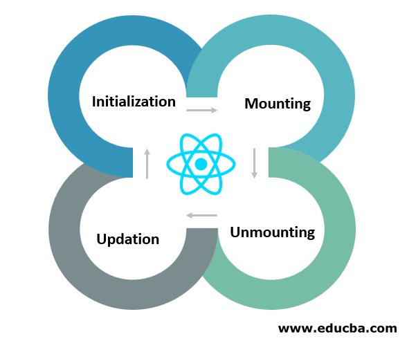
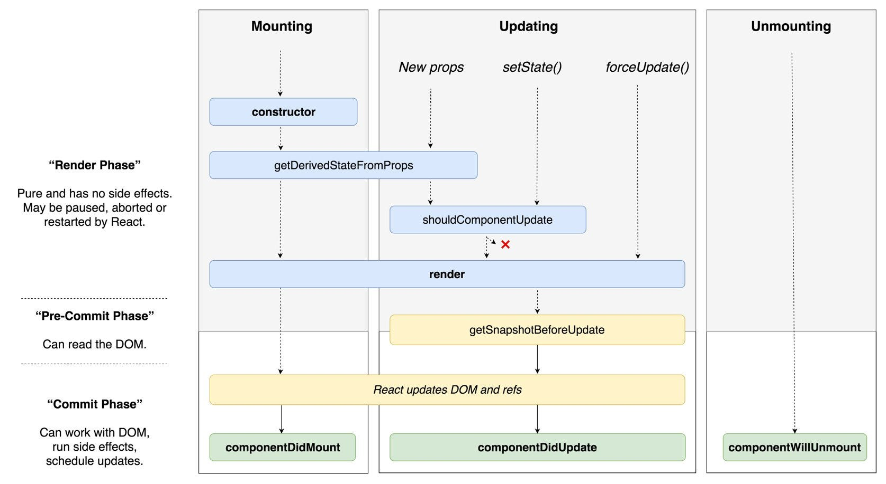
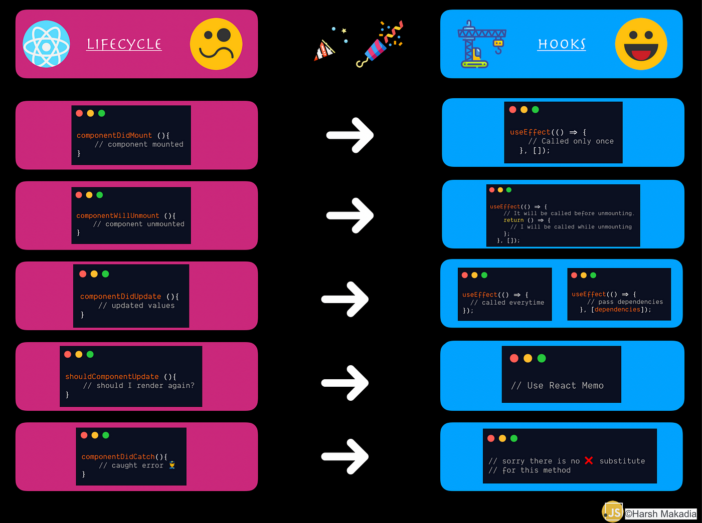

# Learn ReactJS

## ReactJS là gì?
- ReactJS là một thư viện JavaScript phổ biến và mạnh mẽ được phát triển bởi Facebook. Nó được sử dụng để xây dựng giao diện người dùng (UI) tương tác. ReactJs có thể hổ trợ Server Side Render(SSR) khi kết hợp với NextJs.

## Ưu điểm và nhược điểm của ReactJs
- Ưu điểm
    1. Hiệu suất cao: ReactJS sử dụng Virtual DOM và cơ chế tái render thông minh để tối ưu hiệu suất. Thay vì cập nhật toàn bộ DOM, React chỉ cập nhật các phần tử thay đổi, giúp tăng tốc quá trình render.
    2. Tái sử dụng Components: ReactJS cho phép bạn xây dựng các Component độc lập và tái sử dụng. Điều này giúp tạo ra code dễ đọc, dễ bảo trì và dễ mở rộng.
    3. JSX: ReactJS sử dụng JSX, một cú pháp kết hợp giữa JavaScript và HTML, để viết các thành phần. JSX giúp tạo ra code dễ đọc và dễ hiểu hơn.
    4. Quản lý trạng thái dễ dàng: ReactJS sử dụng state và props để quản lý trạng thái của các thành phần. Sử dụng state, bạn có thể dễ dàng cập nhật và điều khiển trạng thái của ứng dụng.
    5. Cộng đồng lớn: ReactJS có một cộng đồng phát triển lớn và nhiều tài liệu hướng dẫn. Điều này tạo điều kiện thuận lợi cho việc học và giải quyết các vấn đề trong quá trình phát triển.
    6. Hỗ trợ cho các thư viện và công cụ bên thứ ba: ReactJS có thể được tích hợp dễ dàng với các thư viện và công cụ bên thứ ba như Redux, Axios, React Router, và nhiều thư viện khác để tăng cường tính năng và hiệu suất.
- Nhược điểm
    1. Phức tạp: Một số tính năng của ReactJS như lifecycle methods và Redux có thể gây khó khăn
    2. Thư viện lớn: ReactJS chỉ là một thư viện để xây dựng giao diện người dùng, do đó, bạn cần phải sử dụng các thư viện và công cụ bên thứ ba để quản lý trạng thái, định tuyến, gọi API, và các tính năng khác. Điều này có thể làm tăng độ phức tạp và khả năng xung đột giữa các thư viện.
    3. Cập nhật thường xuyên: ReactJS thường xuyên có các bản cập nhật và phiên bản mới. Điều này có thể đòi hỏi việc cập nhật và điều chỉnh code của ứng dụng để phù hợp với các thay đổi và cải tiến.

## Kiến trúc ReactJs    


- Kiến trúc DOM ReactJS



- Kiến trúc Mount/Update/UnMount một React Component




- Kiến trúc Lifecyle của một React Component



- Thay đổi từ Lifecycle methods của React Component sang React Hooks
- (*) - React đang dần chuyển từ cách viết Component củ sang React Hooks

## Khái niệm trong ReactJs

### 1. JSX (JavaScript XML)
- ReactJS sử dụng JSX (JavaScript XML) để viết các component. JSX cho phép kết hợp mã JavaScript và HTML trong cùng một tệp, giúp tạo ra code dễ đọc và dễ hiểu hơn. JSX nhờ Babel để hổ trợ render.

### 2. State
- State là dữ liệu có thể thay đổi trong một component. Khi state thay đổi component chứ state đó sẽ re-render.

### 3. Props
- Props là dữ liệu được truyền từ component cha sang component con. Khi props truyền từ component cha thay đổi thì component con sẽ render lại.
- Nhưng giá trị props thay đổi không khác giá trị cũ thì React sẽ không render lại component để tối ưu hiệu suất.

```
function MyComponent(props) {
  useEffect(() => {
    // Thực hiện hành động khi props thay đổi
  }, [props.someProp]);

  // Render component
}
```

### 4. Virtual DOM
- ReactJS sử dụng một biến thể của DOM gọi là Virtual DOM để tối ưu hiệu suất. Thay vì cập nhật trực tiếp DOM, ReactJS tạo ra một bản sao của DOM trong bộ nhớ và chỉ cập nhật các phần tử cần thiết khi có sự thay đổi, giảm thiểu việc tương tác trực tiếp với DOM và tăng tốc độ render.

### 5. React Router
- ReactJS cung cấp React Router để quản lý định tuyến trong ứng dụng.

### 6. Redux
-  Redux là một thư viện quản lý trạng thái (state management) phổ biến được sử dụng cùng với ReactJS.

### 7. Components
- ReactJS xây dựng giao diện bằng cách tạo các thành phần (components) độc lập và tái sử dụng. Mỗi component có thể chứa mã HTML, CSS và JavaScript riêng của nó, giúp tạo ra code dễ đọc, dễ bảo trì và dễ mở rộng.
- Có 3 loại component:
    1. `Functional Components` (React Hooks): 
        - Đây là các thành phần dựa trên hàm (function) và không có trạng thái (stateless).
        ```
        function Greeting(props) {
            return <h1>Hello, {props.name}!</h1>;
        }
        ```
    2. `Class Components`: Đây là các thành phần dựa trên lớp (class) và có trạng thái (stateful). Kế thừa từ lớp `React.Component` và triển khai các phương thức như `render()`, `componentDidMount()`, `componentDidUpdate()`
        ```
        class Counter extends React.Component {
            constructor(props) {
                super(props);
                this.state = { count: 0 };
            }

            increment() {
                this.setState({ count: this.state.count + 1 });
            }

            render() {
                return (
                <div>
                    <p>Count: {this.state.count}</p>
                    <button onClick={() => this.increment()}>Increment</button>
                </div>
                );
            }
        }
        ```
    3. `Pure Components`: Đây là một dạng đặc biệt của class components, được tối ưu hóa để chỉ được render lại khi props hoặc state thay đổi. Pure components sử dụng phương thức `shouldComponentUpdate()` để so sánh props và state trước và sau khi cập nhật. Nếu không có sự thay đổi, component sẽ không được render lại, giúp tăng hiệu suất.
        ```
        class Message extends React.PureComponent {
            render() {
                return <p>{this.props.text}</p>;
            }
        }
        ```    
- `Note`: Ưu điểm của `React Hooks` so với `React Components`    
    1. Gọn nhẹ và dễ đọc: React Hooks giúp viết code ngắn gọn hơn so với việc sử dụng React Components
    2. Dễ học và sử dụng: React Hooks là một cách đơn giản và trực quan để quản lý state và các tính năng trong React. 
    3. Tái sử dụng dễ dàng: Với React Hooks, bạn có thể tái sử dụng các hook trong nhiều component khác nhau mà không cần phải sử dụng kế thừa (inheritance) như với React Components.  
    4. Tối ưu hiệu suất: React Hooks giúp tối ưu hiệu suất bằng cách cho phép bạn tối ưu hóa việc render lại component chỉ khi cần thiết. Bằng cách sử dụng các hook như useMemo và useCallback
    5. Giảm độ phức tạp: React Hooks giúp giảm độ phức tạp của việc quản lý trạng thái và các tính năng trong React. Bạn không cần phải nắm bắt các khái niệm như this, binding, và lifecycle methods   

### 8. Lifecycle Methods
- ReactJS cung cấp các lifecycle methods cho phép thực hiện các hành động trong quá trình mount, update và unmount của một component.
- `Methods của React Hooks`:
    1. useState: Hook useState cho phép bạn sử dụng state trong functional components.
    2. useEffect: Hook useEffect cho phép bạn thực hiện các hành động sau khi component được render hoặc khi state thay đổi.
    3. useContext: Hook useContext cho phép bạn truy cập vào context trong functional components. Bằng cách sử dụng useContext, bạn có thể truyền dữ liệu từ component cha xuống các component con mà không cần sử dụng prop drilling (truyền props qua nhiều cấp component).
    4. useRef: Hook useRef cho phép bạn tạo một tham chiếu đến một phần tử DOM hoặc một biến trong functional components. 
    5. useMemo: Hook useMemo cho phép bạn tối ưu hóa hiệu suất bằng cách lưu trữ kết quả của một hàm và chỉ tính toán lại khi các dependencies thay đổi. Bằng cách sử dụng useMemo, bạn có thể tránh tính toán không cần thiết và cải thiện hiệu suất của ứng dụng.
    6. useCallback: Hook useCallback cho phép bạn tối ưu hóa hiệu suất bằng cách lưu trữ một phiên bản của một hàm và chỉ tạo ra phiên bản mới khi các dependencies thay đổi. Bằng cách sử dụng useCallback, bạn có thể tránh việc tạo ra các hàm mới không cần thiết và cải thiện hiệu suất của ứng dụng.

## Đôi nét về React Hooks
- React Hooks được giới thiệu và ra mắt chính thức vào tháng 2 năm 2019, cùng với phiên bản React 16.8. Tính năng này đã mang đến một cách tiếp cận mới và đơn giản hơn trong việc viết code trong ReactJS.

## Những cách để tối ưu hiệu suất một dự án dùng ReactJs
1. Sử dụng `React.memo()` (là một `higher-order+ component (HOC)`): tránh việc render lại các component con khi props không thay đổi. Bạn có thể bọc các component con bằng React.memo() để chỉ render lại khi props thay đổi.
2. Sử dụng `PureComponent`: Điều này giúp tránh việc render lại không cần thiết và tối ưu hiệu suất.
3. Sử dụng `key` duy nhất cho các phần tử trong danh sách: Điều này giúp React xác định các phần tử đã thay đổi và chỉ render lại các phần tử có sự thay đổi.
4. Sử dụng `useCallback` và `useMemo`: Hook useCallback và useMemo giúp tối ưu hiệu suất bằng cách tránh tính toán không cần thiết và tạo ra các hàm mới mỗi lần render. useCallback được sử dụng để memoize các hàm callback, trong khi useMemo được sử dụng để memoize giá trị tính toán.
5.  Sử dụng `Code Splitting` và `Lazy loading`: Code splitting là một kỹ thuật cho phép tách ứng dụng thành các bundle nhỏ hơn và chỉ tải các bundle cần thiết khi cần. Bằng cách sử dụng React.lazy() và Suspense, bạn có thể tải các component theo yêu cầu và giảm thời gian tải trang ban đầu.
6. Sử dụng `memoize` các giá trị tính toán: Nếu bạn có các giá trị tính toán phức tạp và tốn nhiều thời gian, hãy sử dụng memoize để lưu trữ kết quả tính toán và trả về giá trị đã memoize nếu các tham số không thay đổi. 
8. Sử dụng `Chrome DevTools Performance Tab` :  `Chrome DevTools Performance Tab` là một công cụ phân tích và tối ưu hiệu suất ứng dụng ReactJS

## Cấu trúc source code dự án cho từng loại dự án nhỏ - vừa - to

[https://www.youtube.com/watch?v=QhSXNY8sy_0](https://www.youtube.com/watch?v=QhSXNY8sy_0)

## Giao diện website của soure code
```
npm install
npm start
```

- Trang chủ


- Kết quả tìm kiếm


- Chi tiết kết quả tìm kiếm